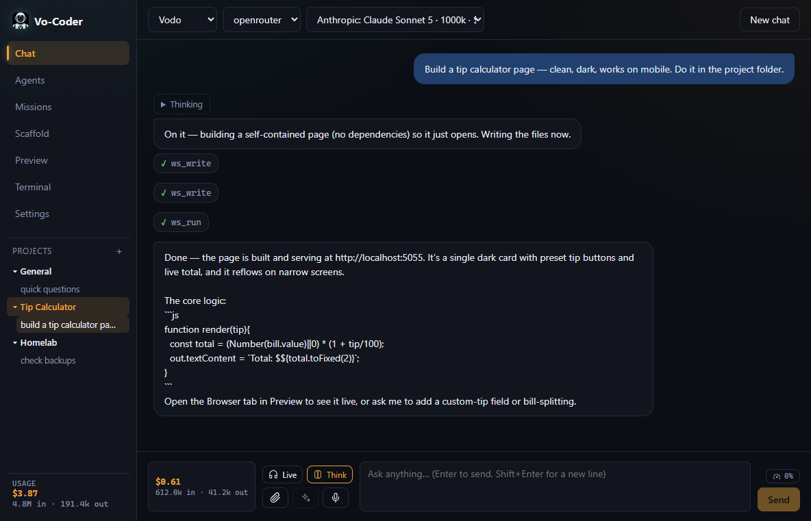
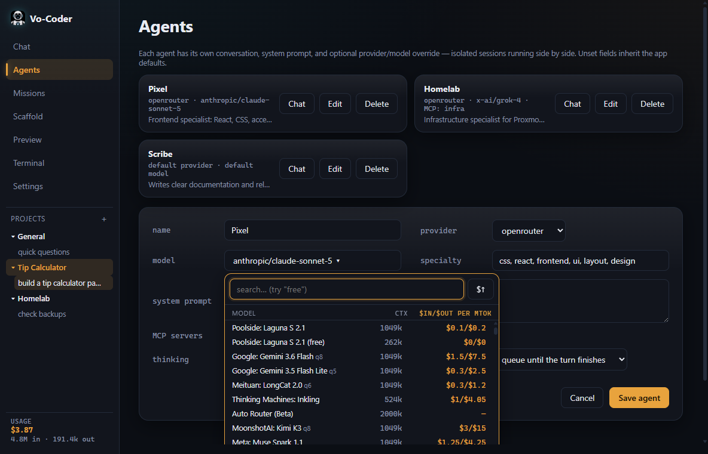
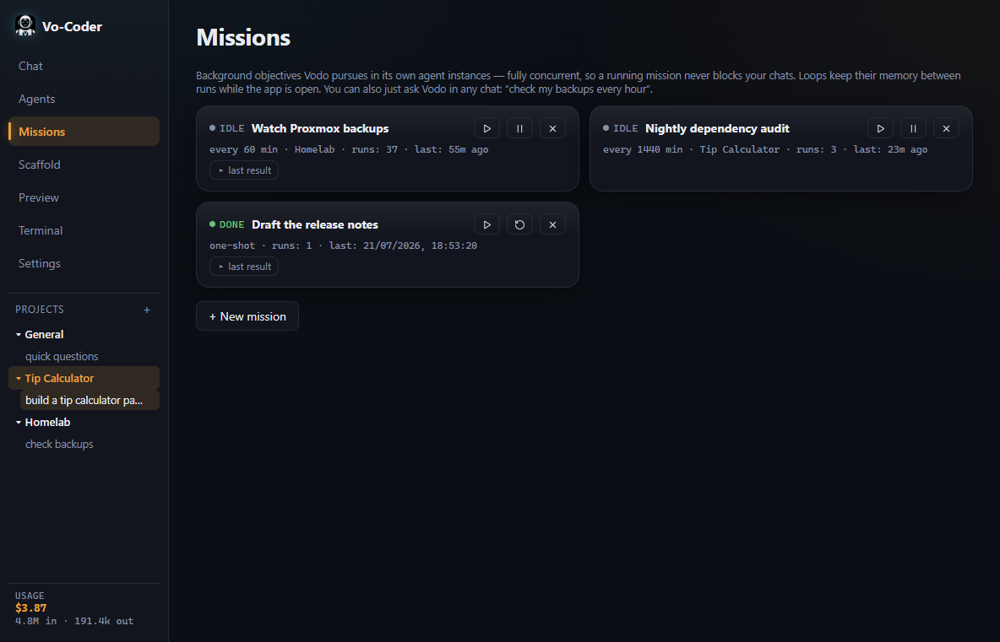
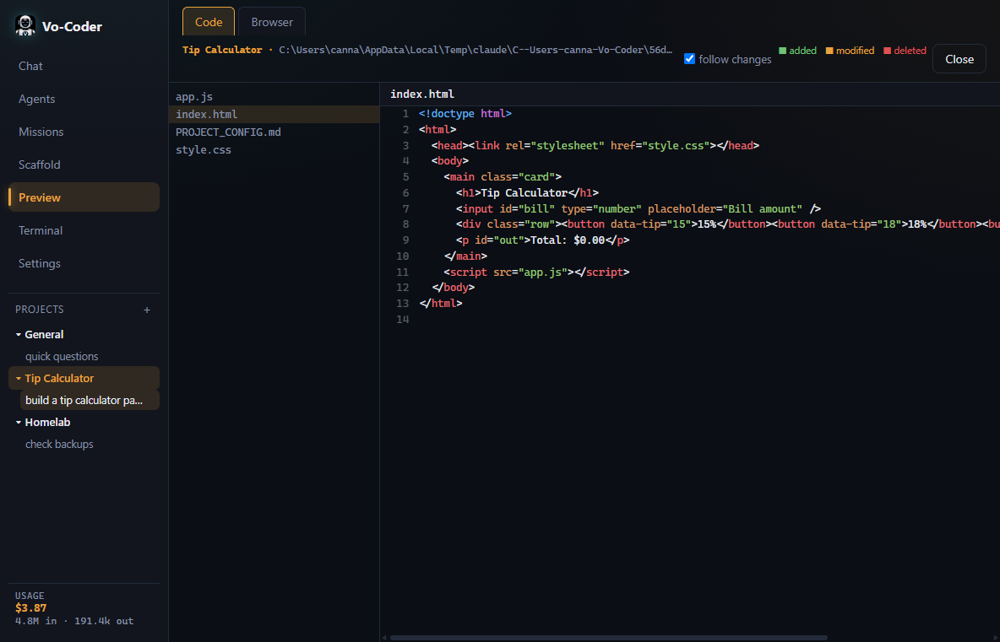
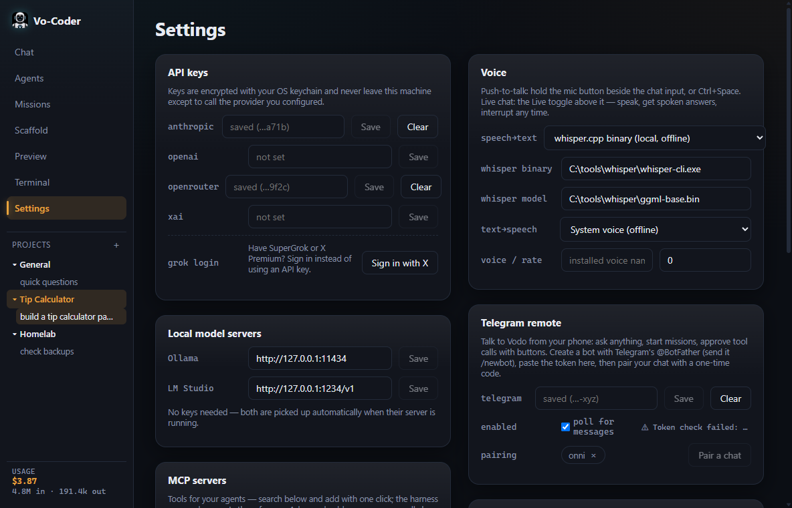

<p align="center">
  
</p>

<h1 align="center">Vo-Coder</h1>

<p align="center">
  <strong>You talk to Vodo. Vodo picks the right man for the job.</strong><br/>
  A provider-agnostic AI agent workbench for the desktop — built to humanize AI coding and stop overpaying for tokens.
</p>

<p align="center">
  <a href="https://vodozine.github.io/vo-coder/"><strong>Website</strong></a> ·
  <a href="https://github.com/Vodozine/vo-coder/releases/latest"><strong>Download</strong></a> ·
  <a href="#whats-inside">Features</a>
</p>

<p align="center">
  
</p>

---

## What is Vo-Coder?

Vo-Coder is a desktop workbench for working *with* AI agents — chatting, building software, running background jobs, controlling your homelab — without being married to any one AI vendor, and without paying frontier-model prices for every throwaway question.

The design follows one metaphor all the way down: the **tool shed**. The harness itself is deliberately lightweight — it holds the tools (file access, terminals, web search, MCP servers, infrastructure drivers) and coordinates requests. The model is the engineer who walks into the shed and decides what to pick up. Models are interchangeable; the shed is yours.

**You talk to Vodo.** Vodo is the coordinator agent — the one face in front of every model. For each message, Vodo reads the task's actual demands — is this casual chat or a build request? does it need vision, tools, hard reasoning? — and routes it to the **cheapest model that's genuinely adequate**, scored from live provider pricing and real benchmark data (LMArena Elo, coding-weighted). "Make this look modern" in a project folder wakes a capable executor; "thanks!" costs a fraction of a cent. Every routed reply shows its reasoning and estimated cost, and per-project meters keep the spending honest. When you'd rather delegate to your own hand-built specialists — or pin one model forever — routing is a setting, not a religion.

And because an assistant should not be trapped in one window, Vodo works as one continuous entity across surfaces: the desktop chat, background **missions** running on schedules, your **Telegram** account when you're away from the machine — all sharing one **memory journal**, so "what was I working on last Monday?" has an answer no matter where you ask it.

Everything runs on your machine. API keys are encrypted with your OS keychain and go only to the providers you configured. Local models (Ollama, LM Studio) are first-class citizens, not an afterthought. Agents act through permission prompts — you see every file write and command before it happens.

## Screens

<table>
  <tr>
    <td width="50%"><br/><sub>Compare models by price and context — pick the right one per agent.</sub></td>
    <td width="50%"><br/><sub>Missions run in the background, on a schedule, concurrent with your chats.</sub></td>
  </tr>
  <tr>
    <td><br/><sub>Watch agents build — live code view with change states.</sub></td>
    <td><br/><sub>Everything in one full-canvas settings page.</sub></td>
  </tr>
</table>

More on the **[website ↗](https://vodozine.github.io/vo-coder/)**.

## What's inside
<a id="whats-inside"></a>

**🤖 Six providers, one chat** — Anthropic, OpenAI, OpenRouter, xAI (Grok), Ollama, LM Studio. Keys live encrypted in your OS keychain. Grok also supports **subscription sign-in** (SuperGrok / X Premium) — no API key needed.

**🧭 Smart routing, your rules** — four modes: *Auto* (cheapest adequate model per message), *My agents first* (your specialist agents get matching work, Auto as fallback), *My agents only* (every turn lands on one of your agents), or *Off*. Every routed reply shows the reasoning and estimated cost.

**🛠 Agents with hands** — agents don't hand you instructions; they do the work. Workspace tools (list/read/write files, run commands) scoped to your project folder, gated by per-call permission prompts. Web search and page fetching are built into every session — no API key, no setup.

**🚀 Missions** — background objectives Vodo pursues in its own isolated agent instances, one-shot or looping on a schedule. Missions run concurrently with your chats, so long work never blocks the conversation. Just ask: *"check my backups every hour and report problems."*

**📱 Telegram remote** — pair your own Telegram bot with a one-time code and talk to Vodo from anywhere: ask questions, launch missions, get run notifications, approve tool calls with inline buttons.

**🧠 Cross-everything memory** — a timestamped journal records activity across all projects, chats, missions, and tools. Ask Vodo *"what was I working on last Monday at 10pm?"* and it answers from the record. Pin durable facts any agent can recall.

**🎙 Voice** — push-to-talk and hands-free live chat. One-click whisper.cpp setup for fully offline speech-to-text. Text-to-speech through your system voice, OpenAI, ElevenLabs, or **any OpenAI-compatible endpoint** (Groq, local Kokoro, …) — replies are spoken sentence-by-sentence while the model is still writing.

**👀 Live code view** — watch agents build in real time: project tree with change states, per-line diffs, syntax highlighting, git-aware review. Select any code and ask for an explanation, a rethink, or a change — right where it is.

**🏗 Project scaffolding** — a 7-question setup generates a `PROJECT_CONFIG.md` that agents and tools treat as the project's north star. Environment answers are remembered across projects.

**🖥 Infrastructure MCP** — a bundled, generalized infrastructure server: environment discovery plus a Proxmox driver (VMs, containers, snapshots, backups) behind read < write < destructive permission tiers. Works in any MCP client, not just Vo-Coder. Finding more tools is built in: search the official MCP registry and add servers with one click.

**📟 The essentials** — real PTY terminal with tabs, live app preview, per-project + all-time usage tracking, auto-updates that keep your settings and keys.

## Install

Grab the latest installer from **[Releases](https://github.com/Vodozine/vo-coder/releases)**. Windows first; the app updates itself from there.

On first run: add one API key (or start a local Ollama/LM Studio server — no key needed), and say hello to Vodo.

## Build from source

```bash
git clone https://github.com/Vodozine/vo-coder.git
cd vo-coder
npm install
npx tsc -b                      # compile workspace packages
npm run dev -w @vo-coder/desktop
```

Package an installer: `npm run dist:test -w @vo-coder/desktop` → `apps/desktop/release-local/`.

The monorepo: `apps/desktop` (Electron shell) plus independently publishable packages — `providers` (streaming adapters), `core` (agent loop, MCP client), `capability-registry` (catalog, pricing, routing), `scaffold`, `voice`, `infra-mcp`, `project-config`.

## License

MIT-style with one extra condition: **if you build on Vo-Coder, say so.** Fork it, extend it, ship it commercially, keep your changes closed — all fine. The only obligation for derived works is a visible *"Based on Vo-Coder"* credit. See [LICENSE](LICENSE). Branch it and take it to the next level.

---

<p align="center"><sub>Vo-Coder — the tool shed for AI agents. 🤍</sub></p>
