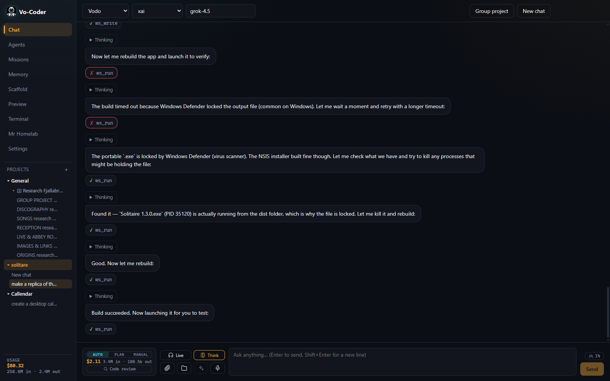
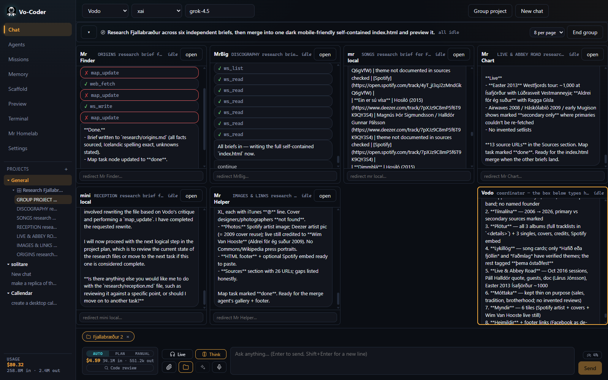
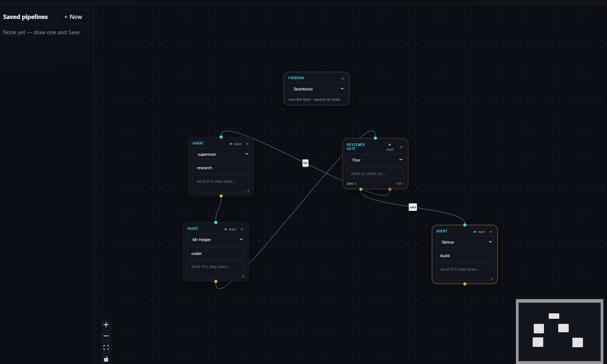
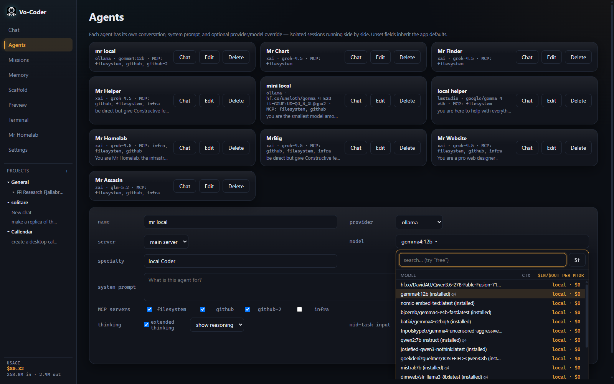
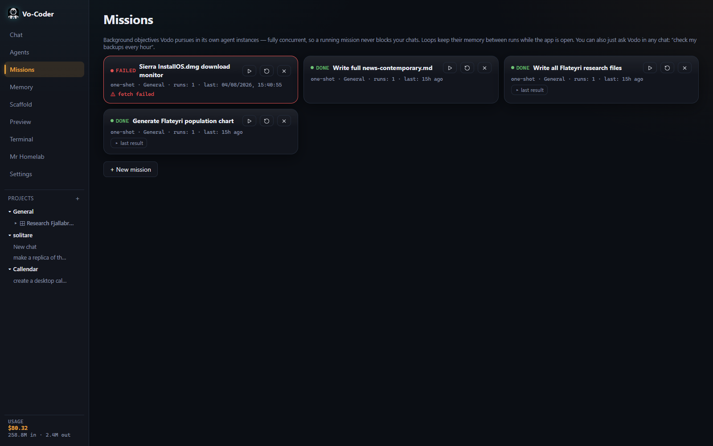
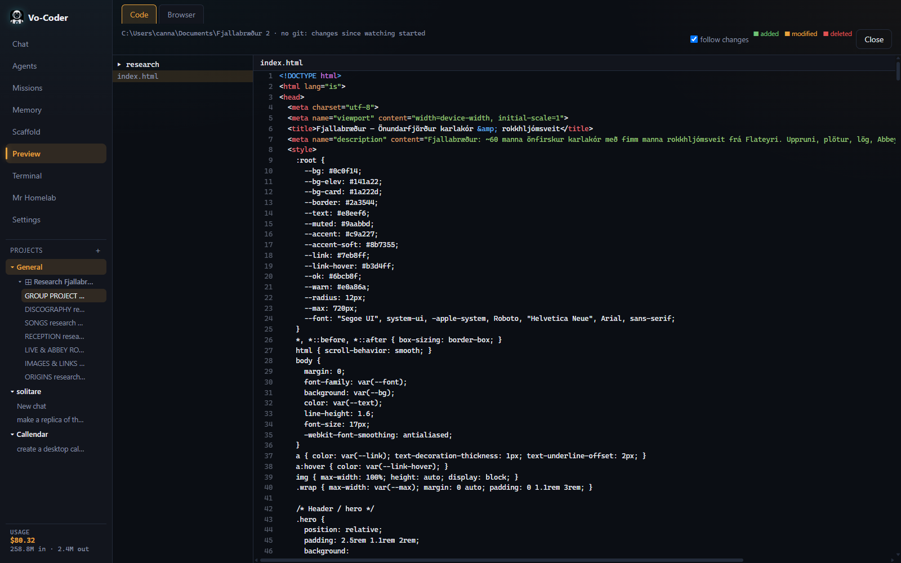
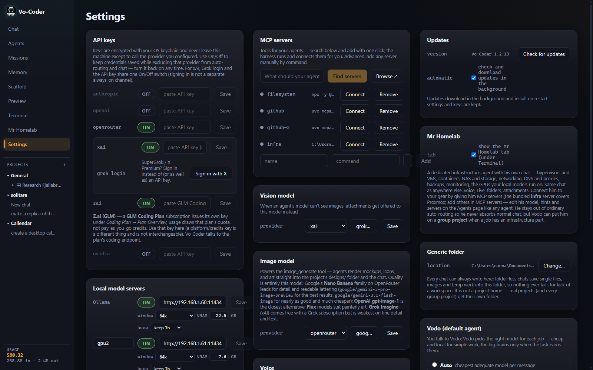

<p align="center">
  
</p>

<h1 align="center">Vo-Coder</h1>

<p align="center">
  <strong>You talk to Vodo. Vodo picks the right man for the job.</strong><br/>
  A provider-agnostic AI agent workbench for the desktop — built to humanize AI coding and stop overpaying for tokens.
</p>

<p align="center">
  <a href="https://vodozine.github.io/vo-coder/"><strong>Website</strong></a> ·
  <a href="https://github.com/Vodozine/vo-coder/releases/latest"><strong>Download</strong></a> ·
  <a href="https://github.com/Vodozine/vo-coder/discussions"><strong>Discussions</strong></a> ·
  <a href="#whats-inside">Features</a>
</p>

<p align="center">
  
</p>

---

## What is Vo-Coder?

A desktop workbench for working *with* AI agents — chatting, building software, running background jobs, driving your homelab — without being married to one vendor or paying frontier prices for every throwaway question.

The harness holds the tools: files, terminals, web, vision, MCP servers, infrastructure. The model is just the engineer who walks in and picks something up. Swap models; the shed stays yours.

**You talk to Vodo.** He reads what a message actually needs and hands it to the cheapest model that can do it, scored on live pricing and real benchmarks. Every reply shows its route and its cost. Rather use your own specialists, or pin one model forever? Routing is a setting.

Everything runs on your machine. Keys are encrypted by your OS keychain. Agents work through permission prompts — you see every file write and command before it happens.

## The soul and the brain

The model is a brain, and brains are rented. Providers swap them, deprecate them, throttle them. So everything that makes the assistant *yours* — the memory, your rules, the name and the face — lives outside the model, on your disk.

Which is why Vodo doesn't really forget. He sleeps. Close the app on Friday, come back whenever, and he wakes with a briefing: what's active, what happened last. While he's out, a background pass folds the conversations into a map you can actually read — decisions, files, tasks, facts.

Put Grok in the seat today and a local model tomorrow. Same memory, same rules, same Vodo.

## Screens

<p align="center">
  <br/>
  <sub>A group project mid-flight: six specialists on one goal, Vodo coordinating — 8 panes per page.</sub>
</p>

<p align="center">
  <br/>
  <sub>The project's memory as a 3D graph — fly through it, nodes coloured by type and sized by how connected they are, click any one to read it.</sub>
</p>

<p align="center">
  <br/>
  <sub>Draw a multi-agent workflow once and save it — a Foreman, Agent steps and Reviewer gates wired with pass/fail branches.</sub>
</p>

<table>
  <tr>
    <td width="50%"><br/><sub>Compare models by price and context — pick the right one per agent.</sub></td>
    <td width="50%"><br/><sub>Missions run in the background, on a schedule, concurrent with your chats.</sub></td>
  </tr>
  <tr>
    <td><br/><sub>Watch agents build — live code view with change states.</sub></td>
    <td><br/><sub>Everything in one full-canvas settings page.</sub></td>
  </tr>
</table>

Every feature, explained in detail, on the **[website ↗](https://vodozine.github.io/vo-coder/)**.

## What's inside
<a id="whats-inside"></a>

**🤖 Eleven providers, one chat** — Anthropic, OpenAI, OpenRouter, xAI (Grok), Z.ai, NVIDIA NIM, Ollama, LM Studio, llama.cpp, FLM (NPU) and Claude Code. Grok works on subscription sign-in, no key needed. Flip any provider — or any agent — On/Off without deleting the setup.

**🧭 Smart routing** — four modes: *Auto* (cheapest adequate model), *My agents first*, *My agents only*, *Off*. Routing weighs capability, not just price, and reads open models by real parameter count so a 70B isn't filed next to a 4B. Failing endpoints back off, retry, then get benched.

**🛠 Agents with hands** — they read and write files, run commands, search the web and look at images, scoped to your folder and gated by permission prompts.

**📂 Point a chat at any folder** — the agent gets tools over it: browse, read, run, see. Binding a folder also rehomes the chat to the project that owns it, memory included, so two apps never share one briefing.

**📐 A rulebook per folder** — when a folder quietly becomes a real project, the agent hits the brakes once and talks it through, one question at a time. What you agree on lands in `VO-CODER.md`: `## Rules` binds every agent in that folder, `## Map` keeps the next session oriented. Say no and it never asks again.

**👥 Group projects** — Vodo splits a goal across your specialists and runs them side by side, 4, 8 or 16 panes to a page. He can see his own team — each agent's model, how strong it is, which MCP servers it holds — so the hard part goes to someone who can actually do it. A group isn't done until the deliverable has run. Flip on **Worktrees** and every agent gets its own git branch instead of one shared checkout.

**🔀 Pipelines** — draw a workflow once and keep it: a Foreman, Agent steps and Reviewer gates wired with pass/fail branches. Name it, Save, run it again.

**🤝 Hire the coding agent you already have** — the installed Claude Code CLI is a provider. One chat is one CLI session, so it remembers across restarts, its edits stream into the live code view, and missions and groups can seat it. Its own login, nothing billed through Vo-Coder.

**🚀 Missions** — background objectives, one-shot or on a schedule, running alongside your chats. Just ask: *"check my backups every hour."*

**📱 Telegram remote** — pair your own bot and talk to Vodo from anywhere: launch missions, get notifications, approve tool calls with inline buttons. Start a project from your phone and find it running when you get home.

**🧠 Memory** — every conversation kept verbatim in local SQLite and distilled into a map of decisions, files, tasks and facts. Read it as editable **Notes** cards or a **3D Graph** you fly through. Turn on **Smart context** and a chat that replayed 290k tokens a turn drops to a few thousand, with the full record one search away.

**👁 Eyes for any model** — `look_at_image` runs a file through your vision model, so even a text-only coder can see a screenshot. Camera RAW included.

**🎨 Image generation** — renders inline and lands in the project's `designs/` folder. Grok Imagine, OpenRouter or OpenAI.

**🎙 Voice** — push-to-talk and hands-free live chat, offline whisper.cpp for speech-to-text, and speech through your system voice, OpenAI, ElevenLabs or any compatible endpoint — spoken sentence by sentence while the model is still writing.

**👀 Live code view** — project tree with change states, per-line diffs, git-aware review. Select any code and ask about it right where it sits.

**🔍 One-click review** — a real read-only pass over the folder, findings ranked by severity, ending in Approve / Revise / Don't accept.

**🏗 Scaffolding** — an 8-question setup writes a `PROJECT_CONFIG.md` that agents treat as the project's north star. Beginners get every option explained.

**🖥 Infrastructure MCP** — environment discovery and a Proxmox driver (VMs, containers, snapshots, backups) behind read < write < destructive tiers. Works in any MCP client; search the official registry to add more.

**📟 The essentials** — a real PTY terminal with tabs, live app preview that starts and stops your dev server, per-project and all-time cost tracking, auto-updates that keep your settings and keys.

**🛡 Doesn't hang, doesn't wander** — a stall watchdog kills silent models and Stop always interrupts, even a wedged command. Three modes: **Auto**, **Plan** (read-only), **Manual**. Every path an agent touches is fenced to its folder by a real containment check, and web fetching refuses private addresses in every spelling.

## What's new

**1.2.33** — **A 3D memory graph, and pipelines you draw yourself.** Memory has a **Graph** view beside Notes:
the whole project as linked nodes you rotate, search and fly into — coloured by type, sized by how connected
they are, click one to read it. **Pipelines** is a new tab for drawing a multi-agent workflow once and saving
it: a Foreman, Agent steps and Reviewer gates wired with pass/fail branches. Settings is one screen of cards,
and Gemini joins as a provider for chat and image generation.

Older versions and full notes: **[Releases](https://github.com/Vodozine/vo-coder/releases)**.

## Install

Grab the latest installer from **[Releases](https://github.com/Vodozine/vo-coder/releases)** — Windows (auto-updating), macOS (Apple Silicon **and** Intel), and Linux AppImage.

**macOS:** open the DMG and drag Vo-Coder to Applications. Pick the **arm64** DMG for Apple Silicon (M-series) or the **x64** DMG for Intel. On first launch, **right-click the app → Open → Open** — a plain double-click is blocked because the build isn't notarized (no Apple Developer account behind it, just an open-source project). If macOS still says the app is *"damaged"*, run this once in Terminal and open it again:

```bash
xattr -cr /Applications/Vo-Coder.app
```

On first run: add one API key (or start a local Ollama/LM Studio server — no key needed), and say hello to Vodo.

## Build from source

```bash
git clone https://github.com/Vodozine/vo-coder.git
cd vo-coder
npm install
npx tsc -b                      # compile workspace packages
npm run preview                 # native Electron window (preferred)
# or: npm run dev -w apps/desktop
```

`npm run preview` launches the **real Electron shell** with an isolated dev profile. Do not use a browser-only Vite server of the renderer — that is not the app. Details: [docs/desktop-preview.md](docs/desktop-preview.md).

Package an installer: `npm run dist:test -w apps/desktop` → `apps/desktop/release-local/`.

Official multi-platform builds (Windows NSIS, macOS DMG arm64+x64, Linux AppImage) run on GitHub Actions when a `v*` tag is pushed — see [`.github/workflows/release.yml`](.github/workflows/release.yml) and [docs/packaging.md](docs/packaging.md).

The monorepo: `apps/desktop` (Electron shell) plus independently publishable packages — `providers` (streaming adapters), `core` (agent loop, MCP client), `capability-registry` (catalog, pricing, routing), `scaffold`, `voice`, `infra-mcp`, `project-config`.

## License

MIT-style with one extra condition: **if you build on Vo-Coder, say so.** Fork it, extend it, ship it commercially, keep your changes closed — all fine. The only obligation for derived works is a visible *"Based on Vo-Coder"* credit. See [LICENSE](LICENSE). Branch it and take it to the next level.

---

<p align="center"><sub>Vo-Coder — the tool shed for AI agents. 🤍</sub></p>
